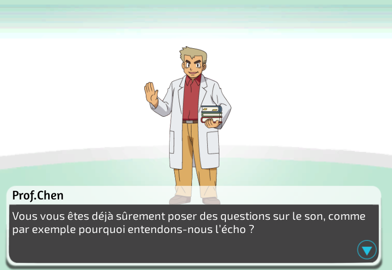
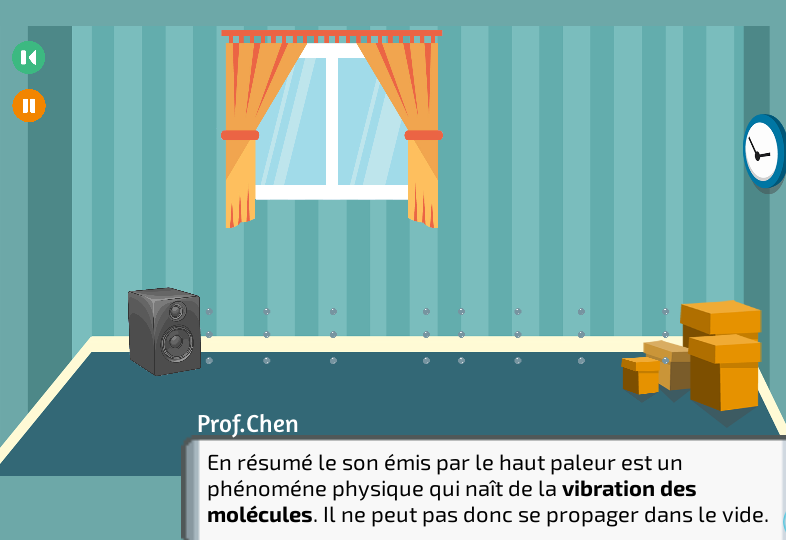
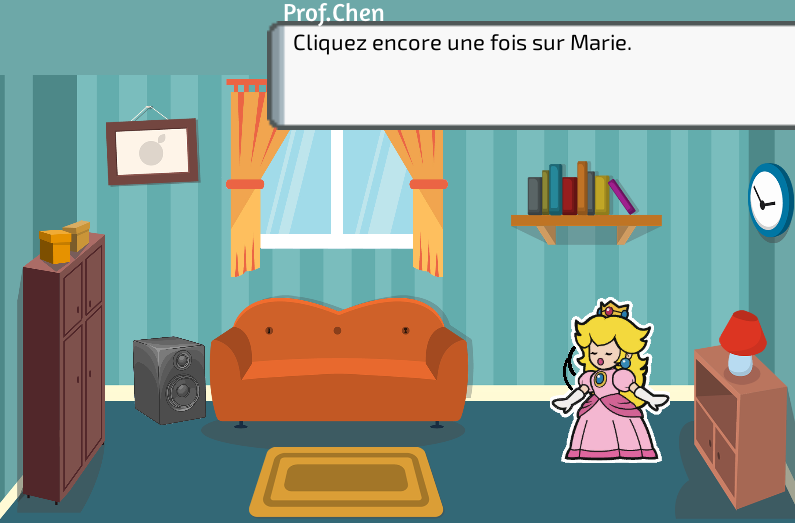

# TPE Son

Projet Unity réalisé dans le cadre de TPE (Travail Personnel Encadré) en Première S Scientifique.

## Pourquoi ce projet ?

Le programme a pour but de visualiser le son qu'on entend sous forme d'ondes sonores.

## Démonstration

## Usage

1. Télécharger le fichier `tpe-son-0.1.zip` dans l'onglet `Releases` de GitHub

2. Décompresser le `.zip` et lancer l'exécutable `Son.exe`.

3. Enjoy !
